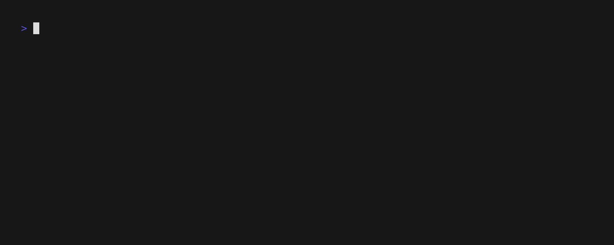

# GoCo 🚀

**Go Conventional** - AI-powered conventional commit message generator with a beautiful Terminal User Interface.

GoCo transforms your git workflow by automatically generating meaningful conventional commit messages using Google's Gemini AI, all wrapped in a gorgeous TUI built with Charm Bracelet libraries.



## ✨ Features

- 🤖 **AI-Powered**: Uses Google Gemini to analyze your changes and generate perfect conventional commit messages
- 🎨 **Beautiful TUI**: Modern terminal interface with styled output, loading spinners, and interactive prompts
- 🔒 **Secure Input**: Password-masked API key prompts when credentials are missing
- ⚙️ **Smart Config**: TOML-based configuration with XDG Base Directory support
- 👁️ **Verbose Mode**: Optional detailed view of git status and diff in styled boxes
- 🎯 **Zero Setup**: Works out of the box with minimal configuration

## 📦 Installation

### From Source

```bash
git clone https://github.com/RazoBeckett/goco.git
cd goco
go build -o goco .
sudo mv goco /usr/local/bin/  # Optional: install globally
```

### Using Go Install

```bash
go install github.com/RazoBeckett/goco@latest
```

## 🚀 Quick Start

1. **Set up your Gemini API key** (get one from [Google AI Studio](https://aistudio.google.com/apikey)):
   ```bash
   export GOCO_GEMINI_KEY="your-api-key-here"
   ```

2. **Navigate to your git repository** and stage your changes:
   ```bash
   cd your-project
   git add .
   ```

3. **Generate a commit message**:
   ```bash
   goco generate
   ```

That's it! GoCo will analyze your staged changes and generate a beautiful conventional commit message.

## 💡 Usage

### Basic Usage

```bash
# Generate commit message for staged changes
goco generate

# Show detailed git status and diff
goco generate --verbose

# Use short flag for verbose mode
goco generate -v
```

### Interactive Features

- **Missing API Key**: GoCo will prompt you securely with a password-masked input
- **Loading Indicator**: Beautiful animated spinner while generating messages
- **Styled Output**: Commit messages appear in elegant green-bordered boxes
- **Git Info**: Verbose mode shows git status and diff in separate styled containers

## ⚙️ Configuration

GoCo uses a TOML configuration file located at `~/.config/goco/config.toml` (following XDG Base Directory specification).

### Default Configuration

```toml
# ~/.config/goco/config.toml
gemini_key_env = "GOCO_GEMINI_KEY"
```

### Custom Environment Variable

You can customize which environment variable GoCo looks for:

```toml
# Use a different environment variable name
gemini_key_env = "MY_CUSTOM_GEMINI_KEY"
```

Then set your custom variable:
```bash
export MY_CUSTOM_GEMINI_KEY="your-api-key-here"
```

### Environment Variables

| Variable | Default | Description |
|----------|---------|-------------|
| `GOCO_GEMINI_KEY` | - | Your Google Gemini API key |
| `XDG_CONFIG_HOME` | `~/.config` | Base directory for config files |

## 🎨 Example Output

### Standard Mode
```
┌─────────────────────────────────────────────────────────────┐
│ feat(auth): implement OAuth2 authentication with Google     │
│                                                             │
│ - Add OAuth2 flow for Google authentication                │
│ - Integrate user session management                        │
│ - Add proper error handling for auth failures              │
└─────────────────────────────────────────────────────────────┘
```

### Verbose Mode
Shows additional styled boxes with:
- 📊 **Git Status**: Current repository status in a blue-bordered box
- 📝 **Git Diff**: Detailed changes in a yellow-bordered box
- ✅ **Commit Message**: Generated message in a green-bordered box

## 🔧 Development

### Building

```bash
go build -o goco .
```

### Running Tests

```bash
go test ./...
```

### Linting & Formatting

```bash
go vet ./...
go fmt ./...
```

### Clean Dependencies

```bash
go mod tidy
```

## 🛠️ Tech Stack

- **Language**: Go 1.21+
- **CLI Framework**: [Cobra](https://github.com/spf13/cobra)
- **TUI Components**: [Charm Bracelet](https://charm.sh/)
  - [Huh](https://github.com/charmbracelet/huh) - Interactive forms
  - [Lipgloss](https://github.com/charmbracelet/lipgloss) - Style definitions
  - [Bubbles](https://github.com/charmbracelet/bubbles) - TUI components
- **AI**: Google Gemini API
- **Config**: [Viper](https://github.com/spf13/viper) with TOML

## 📝 Conventional Commits

GoCo generates commits following the [Conventional Commits](https://www.conventionalcommits.org/) specification:

```
<type>[optional scope]: <description>

[optional body]

[optional footer(s)]
```

### Supported Types
- `feat`: New features
- `fix`: Bug fixes
- `docs`: Documentation changes
- `style`: Code style changes (formatting, etc.)
- `refactor`: Code refactoring
- `test`: Adding or modifying tests
- `chore`: Maintenance tasks

## 🤝 Contributing

1. Fork the repository
2. Create a feature branch: `git checkout -b feat/amazing-feature`
3. Commit your changes: `git commit -m "feat: add amazing feature"`
4. Push to the branch: `git push origin feat/amazing-feature`
5. Open a Pull Request

## 📄 License

This project is licensed under the MIT License - see the [LICENSE](LICENSE) file for details.

## 🙏 Acknowledgments

- [Conventional Commits](https://www.conventionalcommits.org/) for the commit message standard
- [Charm Bracelet](https://charm.sh/) for the amazing TUI libraries
- [Google](https://ai.google.dev/) for the Gemini AI API
- The Go community for excellent tooling and libraries

---

Made with ❤️ and Go. Transform your git workflow today!
